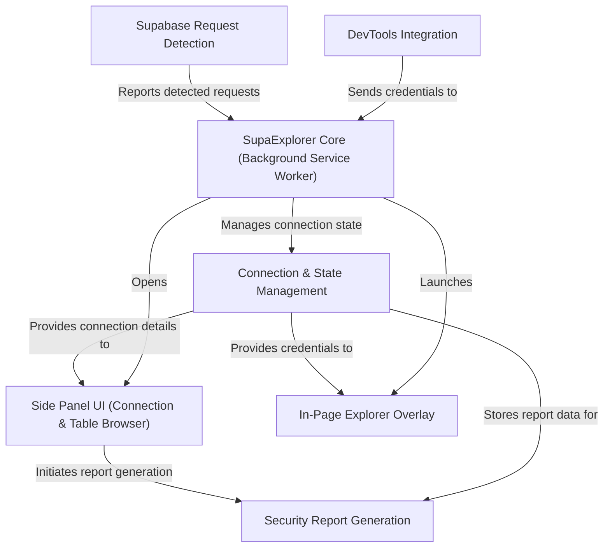

# 𓎩 SupaExplorer
## Supabase Database Explorer Chrome Extension

SupaExplorer enables security reviewers, red-teamers, and developers to inspect a web application's Supabase traffic without leaving the page under test.

## Architecture Diagram

Review the end-to-end flow in the [architecture diagram](./architecture-diagram.md).

## Demo Video

Click on the image to watch the video on YouTube.

## Core Capabilities
- Detects Supabase traffic by instrumenting `fetch`, `XMLHttpRequest`, and `chrome.webRequest`, then caches the live project ID, schema, and API keys it sees.
- Ships a Chrome side panel for browsing tables, checking row counts, and spotting RLS denial responses with at-a-glance status.
- Provides an in-page explorer overlay for quick select/insert/update/delete experiments that reuse the exact headers the page sent.
- Adds a DevTools panel that lists recent Supabase requests and lets you push captured credentials straight into the side panel.
- Generates a printable security report that summarizes table exposure, row counts, and recommended RLS fixes.

## How It Works End-to-End
When a page makes a Supabase call, the background service worker normalizes the credentials, stores them in `chrome.storage.local`, and prompts you via the floating SupaExplorer bubble. Opening the side panel hydrates the connection form, fetches the PostgREST OpenAPI schema, enumerates tables, and issues optional row-count probes so you can see where policies are tight or overly permissive. Double-clicking a table (or using the “Open Explorer” button) loads the full-screen overlay where you can browse data, run filtered queries, and test writes. Navigating away from the site—or losing the keys—automatically clears the cached connection to prevent stale or leaked credentials.

## Installation (Load Unpacked)
1. Clone or download this repository.
2. In Chrome, visit `chrome://extensions`, enable Developer Mode, and choose **Load unpacked**.
3. Select the `chrome_extension` directory. Chrome will install version 0.1.5 of SupaExplorer with its side panel entry.

## Using SupaExplorer Day-to-Day
**Detection bubble.** The bubble appears when Supabase traffic is captured; click it or the toolbar icon to open the side panel.  
**Side panel.** Review the auto-filled connection, switch schemas, and browse tables. Row counts surface 401/permission-denied responses so you can pinpoint RLS gaps quickly. Click **Generate Security Report** to compile a printable summary with RLS findings and recommendations.  
**Explorer overlay.** Double-click a table (or press “Open Explorer”) to bring up the overlay. Tabs cover browsing, inserting, updating, and deleting, and column pickers are pre-populated from OpenAPI plus inferred results.  
**DevTools bridge.** Open the “SupaExplorer” DevTools panel while inspecting a tab to watch Supabase requests stream in. Filter for auth headers and push any captured credentials to the side panel with one click.  
**Resetting state.** Use the “Clear stored credentials” button in the side panel or simply navigate away; the background worker clears detections per tab and drops the cached connection when keys disappear.

## Development Notes
The extension is written against Manifest V3. Key entry points live in `background/background.js` (service worker), `content/detector*.js` (request instrumentation), `panel/sidepanel.*` (Chrome side panel UI), `explorer/explorer.*` (modal explorer), and `devtools/devtools_*` (DevTools integration). Assets in `assets/` and `panel/` supply icons plus the SupaExplorer branding.

## Permissions and Data Handling
- `sidePanel`, `tabs`, and `scripting` let the extension open its UI for the active tab and inject the overlay on demand.
- `webRequest` access is scoped to `https://*.supabase.co/*` so the service worker can notice keys as they leave the browser; all parsing happens locally.
- Credentials never leave the machine: they are stored only in `chrome.storage.local` and cleared automatically when the tab’s context changes.

## Troubleshooting
If the bubble never appears, confirm the page is making requests to `*.supabase.co` and reload the tab to reinject the detector. For row-count failures, check whether the authenticated role actually has `select` access—SupaExplorer surfaces permission errors but does not try to bypass RLS.
