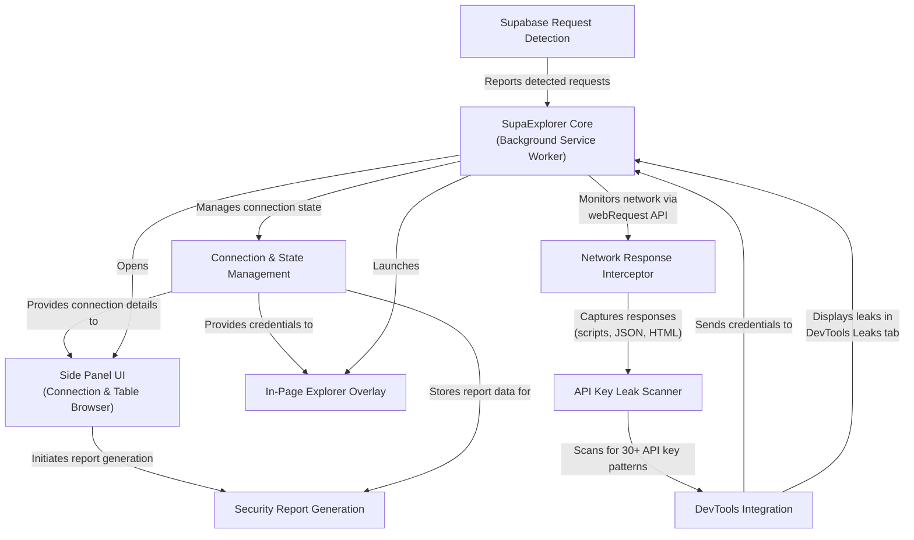

# 𓎩 SupaExplorer
## Supabase Database Explorer & API Key Leak Detector

SupaExplorer enables security reviewers, red-teamers, and developers to inspect a web application's Supabase traffic and detect API key leaks without leaving the page under test. While focused on Supabase security auditing, it also scans for exposed credentials from popular services including AWS, Stripe, OpenAI, GitHub, and more.

## Architecture Diagram

Review the end-to-end flow in the [architecture diagram](./architecture-diagram.md).

## Demo Video

Click on the image to watch the video on YouTube.

## Core Capabilities

### Supabase Security Testing
- Detects Supabase traffic by instrumenting `fetch`, `XMLHttpRequest`, and `chrome.webRequest`, then caches the live project ID, schema, and API keys it sees.
- While the DevTools panel is open, scans captured script/JSON responses for embedded Supabase URLs and JWT API keys—even if no request has fired yet.
- Ships a Chrome side panel for browsing tables, checking row counts, and spotting RLS denial responses with at-a-glance status.
- Provides an in-page explorer overlay for quick select/insert/update/delete experiments that reuse the exact headers the page sent.
- Adds a DevTools panel that lists recent Supabase requests and lets you push captured credentials straight into the side panel.
- Generates a printable security report that summarizes table exposure, row counts, and recommended RLS fixes.

### API Key Leak Detection
- **Real-time scanning** of network responses (scripts, HTML, JSON) for exposed API keys from 30+ popular services.
- **Pattern recognition** for AWS Access Keys, Stripe API keys, OpenAI tokens, GitHub Personal Access Tokens, SendGrid, Twilio, Slack, and many more.
- **Smart filtering** reduces false positives:
  - Automatically excludes CSS/font files by default
  - Detects and skips base64-encoded font/image data URIs
  - Uses entropy analysis to filter out repetitive patterns (e.g., "AAAAAAA...")
  - Maintains a deny list of known false positives
- **Detailed leak reports** in the DevTools panel including the matched value, pattern type, context, and source location.
- **Automated scanning** while DevTools is open, catching leaks as pages load.
- **Customizable** scanning with options to adjust file exclusions, entropy thresholds, and pattern groups.

## How It Works End-to-End

### Supabase Testing Flow
When a page makes a Supabase call, the background service worker normalizes the credentials, stores them in `chrome.storage.local`, and prompts you via the floating SupaExplorer bubble. Opening the side panel hydrates the connection form, fetches the PostgREST OpenAPI schema, enumerates tables, and issues optional row-count probes so you can see where policies are tight or overly permissive. Double-clicking a table (or using the "Open Explorer" button) loads the full-screen overlay where you can browse data, run filtered queries, and test writes. Navigating away from the site—or losing the keys—automatically clears the cached connection to prevent stale or leaked credentials.

### API Key Leak Detection Flow
As your browser loads pages with the DevTools panel open, SupaExplorer's scanner intercepts network responses (JavaScript bundles, API responses, HTML documents) and runs pattern matching against known API key formats. When a leak is detected, it appears immediately in the "Leaks" tab of the DevTools panel with full details about the finding, including the matched value, pattern type, surrounding context, and source URL. All scanning happens locally—no data leaves your machine.

## Installation (Load Unpacked)
1. Clone or download this repository.
2. In Chrome, visit `chrome://extensions`, enable Developer Mode, and choose **Load unpacked**.
3. Select the `chrome_extension` directory. Chrome will install version 0.1.5 of SupaExplorer with its side panel entry.

## Using SupaExplorer Day-to-Day

### Supabase Testing
**Detection bubble.** The bubble appears when Supabase traffic is captured; click it or the toolbar icon to open the side panel.  
**Side panel.** Review the auto-filled connection, switch schemas, and browse tables. Row counts surface 401/permission-denied responses so you can pinpoint RLS gaps quickly. Click **Generate Security Report** to compile a printable summary with RLS findings and recommendations.  
**Explorer overlay.** Double-click a table (or press "Open Explorer") to bring up the overlay. Tabs cover browsing, inserting, updating, and deleting, and column pickers are pre-populated from OpenAPI plus inferred results.  
**DevTools bridge.** Open the "SupaExplorer" DevTools panel while inspecting a tab to watch Supabase requests stream in. It also scans script/JSON responses for hard-coded Supabase credentials, so preloaded bundles (like Next.js chunks) surface instantly. Filter for auth headers and push any captured credentials to the side panel with one click.  
**Resetting state.** Use the "Clear stored credentials" button in the side panel or simply navigate away; the background worker clears detections per tab and drops the cached connection when keys disappear.

### API Key Leak Monitoring
**DevTools scanning.** With the SupaExplorer DevTools panel open, network traffic is automatically scanned for exposed API keys—no configuration needed.  
**Leak log.** Switch to the "Leaks" tab in the DevTools panel to see all detected leaks with matched values, pattern types, context snippets, and source URLs.  
**Pattern library.** The scanner recognizes 30+ API key patterns including AWS, Stripe, OpenAI, GitHub, Google Cloud, Azure, SendGrid, Twilio, Slack, and more.  
**False positive filtering.** The scanner intelligently filters common false positives:
  - CSS/SCSS/font files are excluded by default
  - Base64-encoded fonts and images in data URIs are skipped
  - Low-entropy patterns (repetitive characters) are filtered out
  - Known false positives are maintained in a deny list  
**Automatic deduplication.** Identical leaks from the same source are shown only once to reduce noise.  
**Customization.** Advanced users can customize the scanner behavior via `createLeakScanner()` options in `shared/leak_scanner.js`:
  - `excludedExtensions`: Array of file extensions to skip (default: `.css`, `.scss`, `.sass`, `.less`, `.woff`, `.woff2`, `.ttf`, `.eot`, `.otf`)
  - `minEntropy`: Minimum Shannon entropy for AWS keys (default: `3.0`)
  - `includeEncoded`: Whether to scan base64-decoded content (default: `true`)
  - `denyList`: Custom list of known false positives to ignore

## Development Notes
The extension is written against Manifest V3. Key entry points live in `background/background.js` (service worker), `content/detector*.js` (request instrumentation), `panel/sidepanel.*` (Chrome side panel UI), `explorer/explorer.*` (modal explorer), `devtools/devtools_*` (DevTools integration), and `shared/leak_scanner.js` (API key pattern matching). Assets in `assets/` and `panel/` supply icons plus the SupaExplorer branding.

## Permissions and Data Handling
- `sidePanel`, `tabs`, and `scripting` let the extension open its UI for the active tab and inject the overlay on demand.
- `webRequest` access monitors network responses for Supabase credentials and API key leaks; all parsing happens locally.
- Credentials and leak reports never leave the machine: they are stored only in `chrome.storage.local` and cleared automatically when the tab's context changes.

## Troubleshooting
If the bubble never appears, confirm the page is making requests to `*.supabase.co` and reload the tab to reinject the detector. For row-count failures, check whether the authenticated role actually has `select` access—SupaExplorer surfaces permission errors but does not try to bypass RLS.
